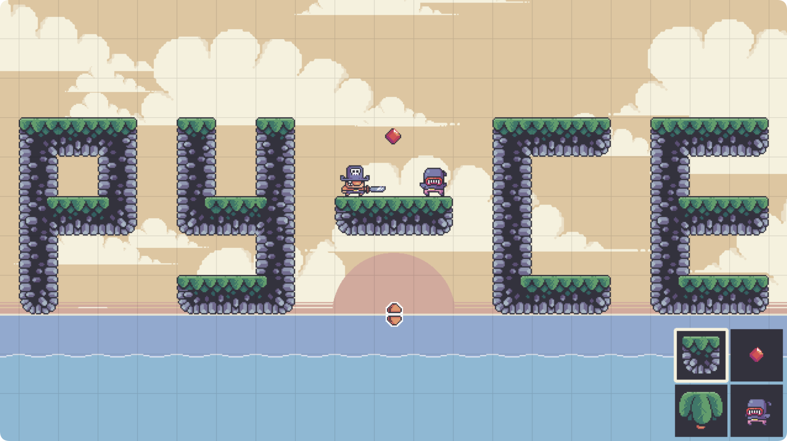

# MARIO MAKER GAME

    <em>
        Mario Maker is a highly creative platform that empowers players to design their own unique game levels through a user-friendly Editor interface. Players can easily drag and drop various items, obstacles, and enemies to build dynamic and engaging levels. The intuitive design tools are complemented by immersive sound effects and visual elements, allowing for a more vibrant and polished gameplay experience. After constructing their level, players can switch to the play mode to fully interact with their creation, testing the challenges and enjoying the seamless integration of audio and effects. This blend of creativity, gameplay, and the ability to share and explore others’ levels offers endless possibilities, making each level both a personal achievement and a new adventure.
    </em>

